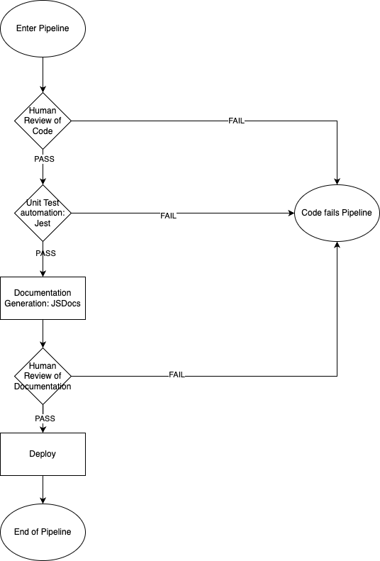

# CI/CD Pipeline Diagram



# Currently Functional:

We currently have a github action set up to run Jest to run unit tests on our code whenever something is pushed to the CI/CD branch. Right now, we still in the "testing phase" of writing these tests so we just have one test which evaluates that the subtraction function embedded below returns the right value.

```
/**
 * Represents subtraction between two numbers
 *
 */
function subtraction(a, b) {
    return a - b;
 }
 module.exports = subtraction;
```

It is being testing using this code:

```
const subtraction = require('./subtraction');
test('subtracts 4 - 2 to equal 2', () => {
   expect(subtraction(4, 2)).toBe(2);
});
```

The code to test along with the file containing the function being test this are stored at:
`Jest-UnitTests/subtraction.test.js`

# In Progress

We also plan on using JSDocs to automatically create documentation for all of our functions. We tried to do this on our CI/CD meeting on 5/15/2023, and while it worked locally, we couldn't get it to work on github via actions. The plan moving forward is to spend a bit of time learning more about yaml files to figure out why we couldn't get JSDocs to work (running the wrong commands, task might not be written properly, etc.)

Beyond that we also wish to employ human review of Code and Documentation into our CI/CD pipeline. We still need to determine standards for each of these and figure out who will do what (details need to be ironed out), but we decided that we should have 2 stages of human review for any code that is pushed into main. The first is code review, which will happen in the form of a pull request. Our main branch is currently set up so that we cannot directly push to it. Instead changes must be worked on in a separate branch and a pull request needs to be made. From there a person will verify that the code "looks good" and resolve any issues before merging. This is the first step of the CI/CD pipeline.

Towards the end we will have another round of human code review, but this time for the documentation. Since our documentation will be auto generated, we want to make sure that the output of said process is correct. We will do this by having another person/group of people look over the documentation to verify its completeness.

# Planned for the Future

We want to also add code "prettification" and a code quality tool. The goal with these is to help enforce coding style and verify quality which will help make our product more robust and uniform in style. We briefly tried investigating free ways to accomplish these tasks automatically, but we couldn't find anything that was free and would work well with github actions. We'll need to look into this in the upcoming weeks since the importance of making our product look and feel the same everywhere was conveyed to us in lecture.
