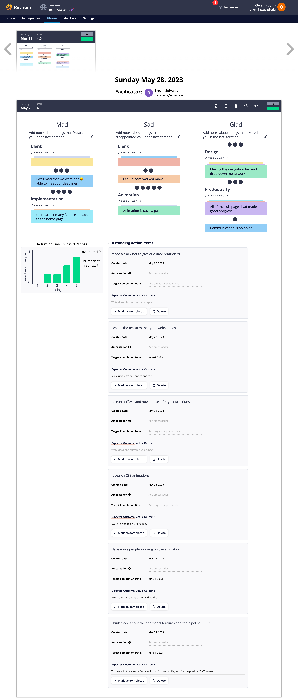

(Name your file the date-topic.md (mmddyy-topic.md). For example 011621-kickoff.md.)

# Meeting Minutes: 05/28, 1:15 pm - 2:00 pm

#### Team 20: 2020 Visionaries

#### Sprint Retrospective at Port of San Diego Room, Price Center 3rd floor

#### Present Members:

- Devika Torvi

- Sean Yen

- Brevin Gabrield

- Brandon Kao

- Owen Huynh

- Thinh Vo

- Doheon Kim

### Agenda

Go over what went bad/great during our first agile sprint

#### (unresolved business)

None

## Artifacts

#### What went wrong

- During our sprint (~3 weeks long) we set verbal deadlines i.e. "let's try to get the basic functionality of thr website done by next week" that were largely ignored
- Some groups also ran out of features to implement because they were waiting for the other teams to complete their part
- Some people felt that they didn't get to/end up working as much as others
- Many people found that doing animations with CSS/Javascript was hard\

#### What went good

- Many people liked the process of designing their webpages and the elements within it
- Generally we thought each group made good progress and reached a working prototype (which puts us on track, maybe even ahead of the rest of the class based on the results of the in-class progress checks)
- Communication within groups went well

#### Action Plan

- To resolve the due date issues, we are thinking of developing a slack bot or other notification system to help keep the group on track with deadlines moving forward. This will hopefully help enforce deadlines better than just the verbal agreement used in the last sprint.
- Develope a plan to improve use of human resources. The main page team felt that their group was waiting for others to finish since it serves as the hub ofr all of the other pages. Next time, we will spend time thinking of the dependencies and allocate people power while taking this into consideration
- Since many of us also had issues with testing and CI/CD, we're taking some time to learn more about YAML and Jest so we can write some automated unit tests for our code. We're also taking some time to research ways to incorporate code linting/quality checks into our CI/CD pipeline since ours currently does not have either.
- For animations, we should put off working on them until the very end because they were quite complicated and time consuming, which delayed progression on the webpage if they were done early on in the page's development. Additionally, we considered having more people working on an animation (possibly splitting resources across groups/borrowing a more experienced developer) to make it easier to tackle this component.
-

### Decisions made

See the "Action Plan" section above

#### Undiscussed business for next meeting

Figure out who is going to record the video

#### Meeting finished at: 1:50 pm\*
