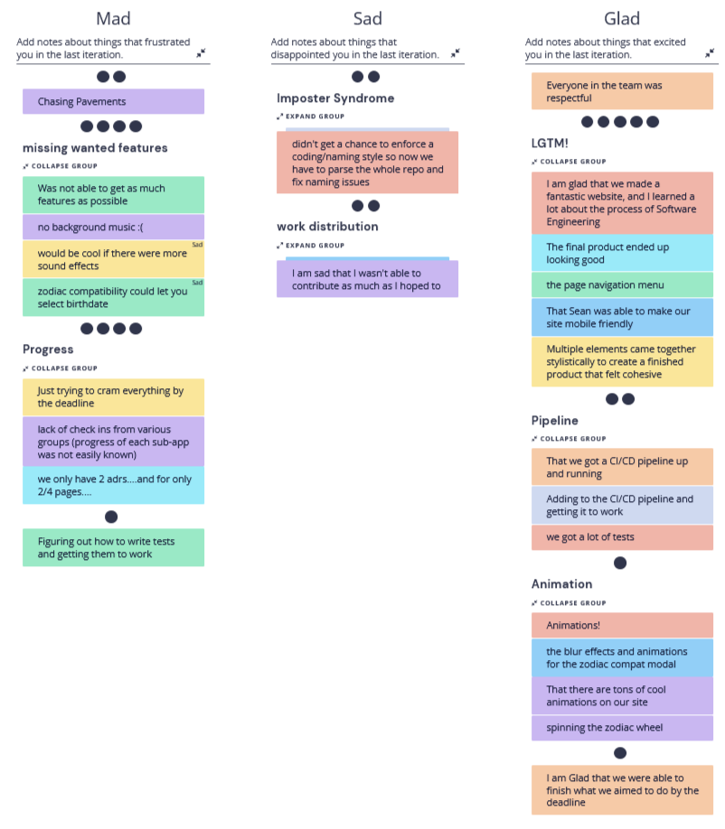
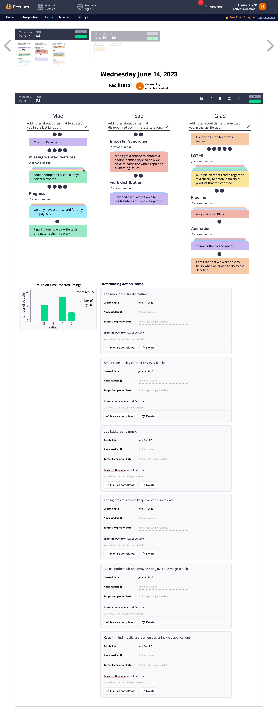

# Meeting Minutes: 05/28, 4:45 pm - 5:45 pm

#### Team 20: 2020 Visionaries

#### Sprint Retrospective on Zoom

#### Present Members:

- Sean Yen
- Owen Huynh
- Brevin Gabriel Salvania
- Do Heon Kim
- Tyler Lo
- Brandon Kao

### Agenda

- Go over what went bad/great during our second agile sprint

#### Unresolved business

- None

## Artifacts

#### What went wrong

- We weren't able to get as much features as we wanted, such as including background music, having more sound effects, and being able to select your own birthday in the Love Compatibility app (Formerly Zodiac Compatibility)
- Lack of work productivity led to immense work being done at the very end, as a result of trying to cram everything by the deadline. Some items that were necessary were not done and there was a lack of check ins from the groups, so it was difficult to know how each group was faring
- Writing tests and getting them to work was frustrating. Furthermore, some found CSS still hard to use.
- Because of a lack of communication and a lack of a style guideline, every group's naming/coding style differed and now time must be spent fixing that
- Some people wanted to contribute more than they did and it felt like there were only a few people actually working on developing the app

#### What went good

- Everyone in the team was respectful, so the group felt psychological safety
- The final product looks amazing and we feel proud of what we did
  - Everything came together and the product feels cohesive
  - Page navigation menu is clean and present in every sub-application
  - The website became mobile friendly thanks to Sean
  - People felt they learned a lot about Software Engineering through this project
- The pipeline got up and running. Adding to it and getting it to work felt like a real accomplishment.
  - We also got a lot of tests to test our code
- The website now has animations that look awesome and make the website look cool. For example, the zodiac compatibility model has blur effects and the wheel can be spun
- People are happy that they were able to finish what they aimed to do by the deadline

#### Action Plan

- If we had more time to work on this project, one thing we would add is more accessibility features and keep in mind other users (like mobile users). We want our website to be accessible to all and we weren't able to focus on that in this sprint because we were focused on just developing the app itself
- For our CI/CD pipeline, we'd like to add a code quality checker to ensure our code looks good and is of high quality. Right now we only have prettier to ensure that our code conforms to a consistent style and linting to find and fix problems that could occur in our code. They don't really check the quality of the code itself, so we'd like to add that in the future
- As mentioned before, we'd like to add background music to our website, and preferably have it seamlessly transition when entering sub-applications (i.e. don't suddenly stop), though that seems to be difficult. If we do that, then we have a plan where we add page animations between each sub-application.
- Because we had issues keeping everyone on track, we would like to add bots to slack to keep everyone up to date. This would hopefully resolve issues of procrastination and let everyone know what needs to be done before its too late
- We are considering making another sub-application and possibly bringing over the Magic 8 Ball. Having more features is nice but it most likely will be too much workload, so its only a possibility.

### Decisions made

See the "Action Plan" section above

#### Undiscussed business for next meeting

None

#### Meeting finished at: 5:45 pm\*
