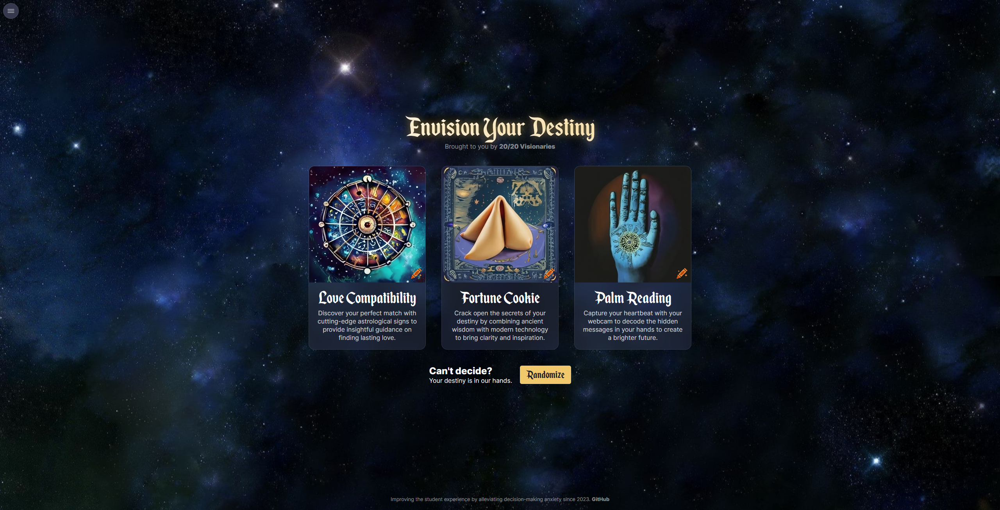
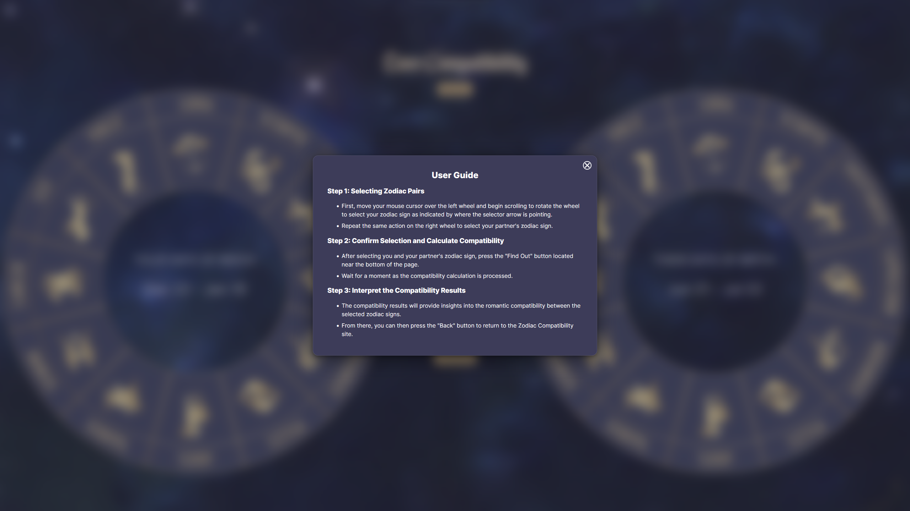
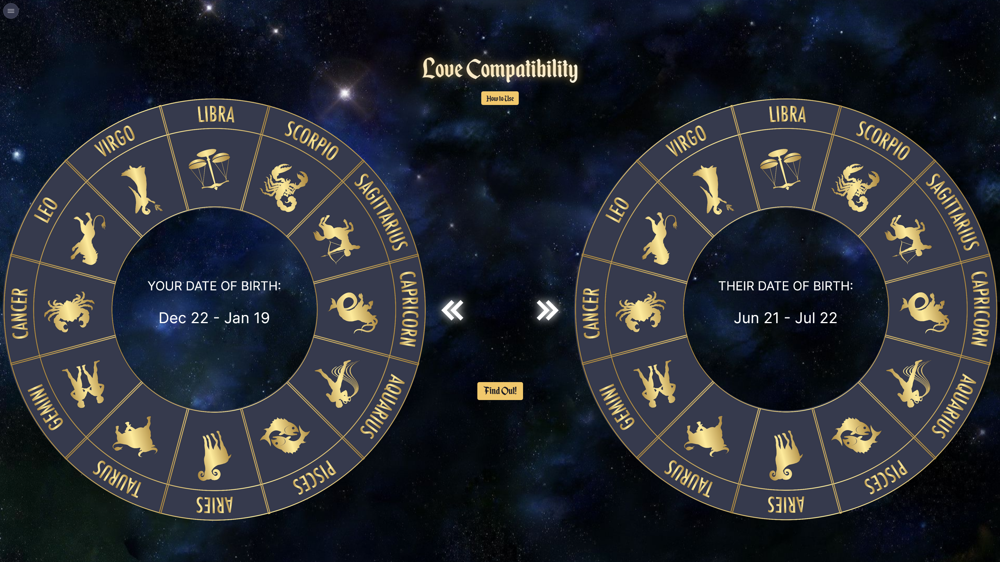
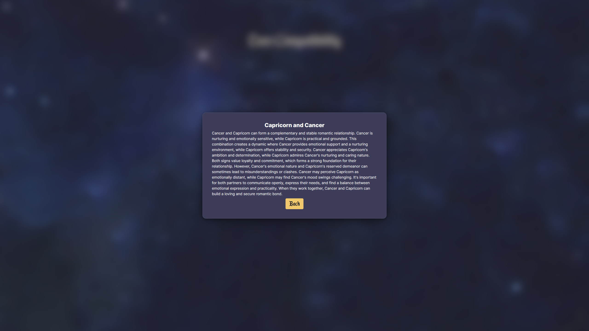
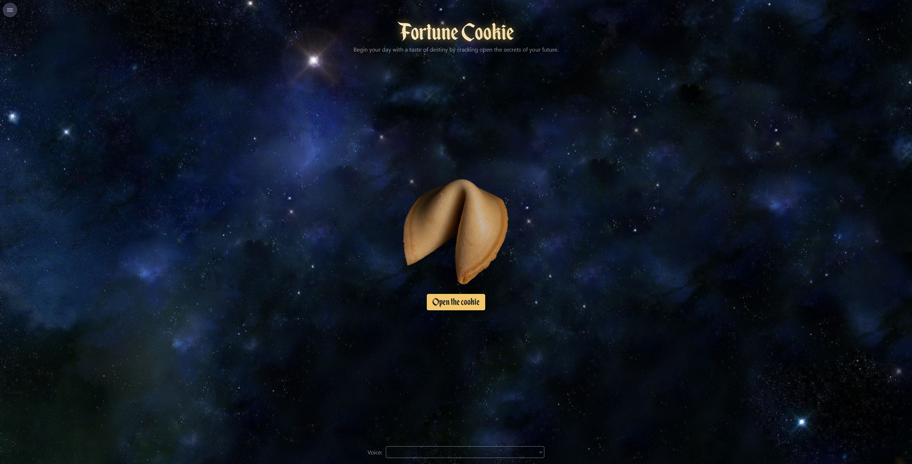
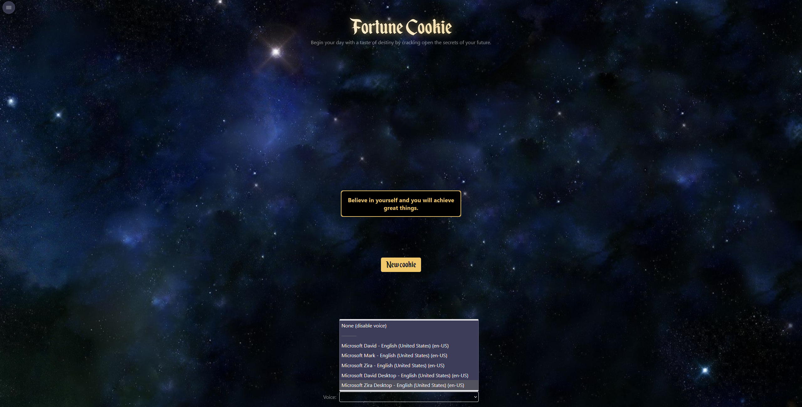
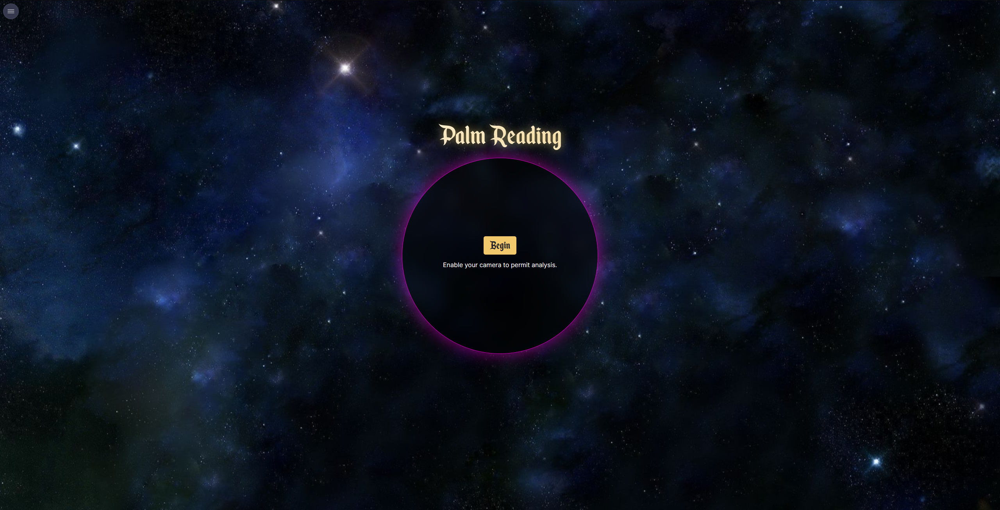
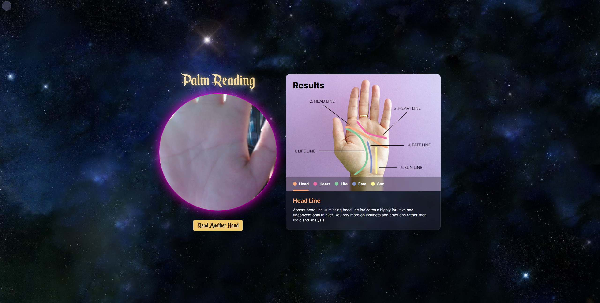
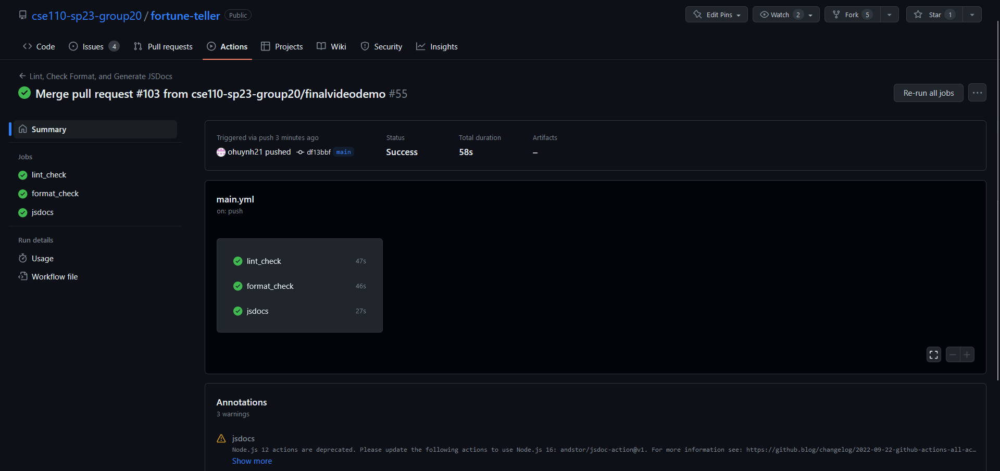
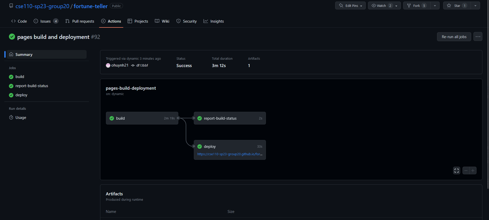

# Meeting Minutes: 06/14, 4:10 pm - 4:40 pm

#### Team 20: 2020 Visionaries

#### Sprint Review on Zoom

#### Present Members:

- Sean Yen
- Owen Huynh
- Brevin Gabriel Salvania
- Do Heon Kim
- Tyler Lo
- Brandon Kao

### Agenda

- Go over what every group did during the second sprint and present what they did and what they worked on

#### Unresolved business

- None

# Key Points

## Main Page

### Overall site:

- Design overhaul throughout entire site
  - Consistent heading and button styles, background images, frosted glass aesthetic, font
  - Added animations, but they can be disabled with `(prefers-reduced-motion)`
  - Entire website should be mobile- and touch-friendly, as well as keyboard accessible with the tab key
- App name: “En**vision** Your Destiny” (from Team 20/20 **Vision**aries) and theme color based on home page button color
- Site navigation through non-intrusive menu button on top left corner that lists all pages on the site

### Home Page:

- The positioning and spacing of the app cards have been adjusted to look cleaner and more visually appealing
- The randomize button has been moved to the center of the screen
- The header (title and subtitle) is now styled with the default title font and subtext font
- Added links to team page and GitHub repo

### Navigation:

- A global dropdown navigation window has been added to to each part of the application/website enable navigation between each sub app
  - Appears in the top left corner and when hovered over, will drop down the menu as shown above

### Love Compatibility (Formerly Zodiac Compatibility):

- A how to use button has been added to instruct users on how to spin the wheels since it wasn’t clear enough before
- Arrows have been added to indicate which zodiac has been selected
- We have filled in the blank space in the center of each wheel with a date range so users can easily identify their zodiac based on their date of birth if they don’t already know it
- Added compatibility results text to the results pop-up for all 78 unique pairings
  - This took forever to do even with ChatGPT
- Added animations:
  - Wheels slide into the screen on page load
  - Wheels slide off the screen to reveal the results page
  - Wheels slide back onto the screen when the user presses the go back button instead of just reloading the page (improve site performance)
- Style changes
  - Wheels design has been updated to be more congruent with the aesthetic and theme of the website
  - The color and font of popups and text on the page have been updated to the global common style
  - Buttons also now do the color shimmer effect on hover
- Functionality changes
  - The wheels can now be spun by clicking and dragging (click and hold to rotate), this makes the app more accessible to mobile users who can’t hover their cursor over the wheels and scroll
- Other changes
  - Renamed to love compatibility because zodiac compatibility couldn’t fit on the title card without decreasing the font size
    - And it fit with the student theme more

### Fortune Cookie:

- Animation has been added when opening the fortune cookie, where half the cookie falls off, a slip of paper comes out of the fortune cookie while the other half falls off screen, and the fortune is read out loud (if the user hasn’t disabled the voice)
- Navigation bar has been revamped. Its now located in the top left corner and is present across all applications
- Audio options have been combined and are at the bottom middle of the page. Turning off voice is now an option in the list instead of being its own check box
- More buttons added, namely the **cookie image button** (another option to open the cookie), **reset button** (brings another cookie down after one has been cracked, basically resetting the website back to the start), and **skip animation button** (skips the animation of the fortune cookie cracking/falling back down.)
- Added more fortunes to the array of fortunes that can be read out. They are more geared towards college students, with them being college themed and romance-college themed.
- Cookie.test.js has been added to test some possible errors in the fortune cookie website,(Button tests, speech-synthesis tests…)
- Fortunes.js added to move the fortune prompts to this file

### Palm Reading

- Previously was almost entirely blank
- Shows a heartbeat graph while “scanning” the palm
- Shows results after the palm is “scanned”
- Palm reader now gives fortunes (was previously blank)
- Background has been changed to the global common background

### CI/CD Pipeline

- Works by first running the lint_check, format_check, and jsdocs. The the page will be built and deployed. Finally, after the page has been deployed, runs testing (Jest/Puppeteer) to run our tests on the newly deployed webpage
- Prettier configuration to ensure that code conforms to a consistent style
- JSDOCs to make documentation for our javascript files
- Site deployment with Github pages
- Jest/Puppeteer for testing our code/functions and make sure the website functions as expected
  - Also runs after github pages is successfully deployed
- Eslint.json file finds and fixes problems that could occur in our code
- Manually-triggered workflow that automatically formats all files in selected branch with Prettier to help resolve failing linting tests
